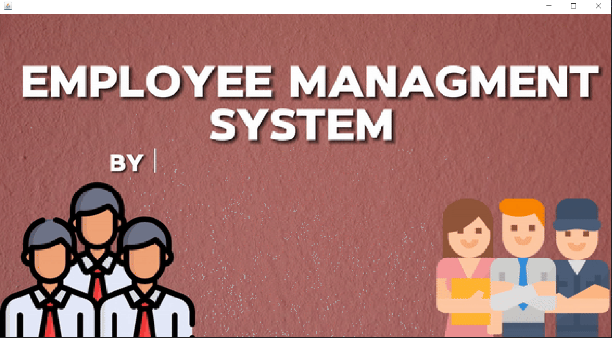
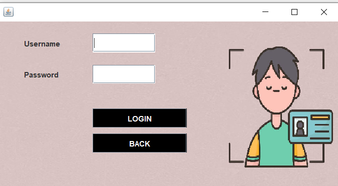
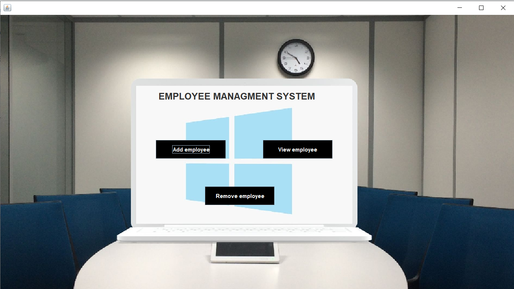
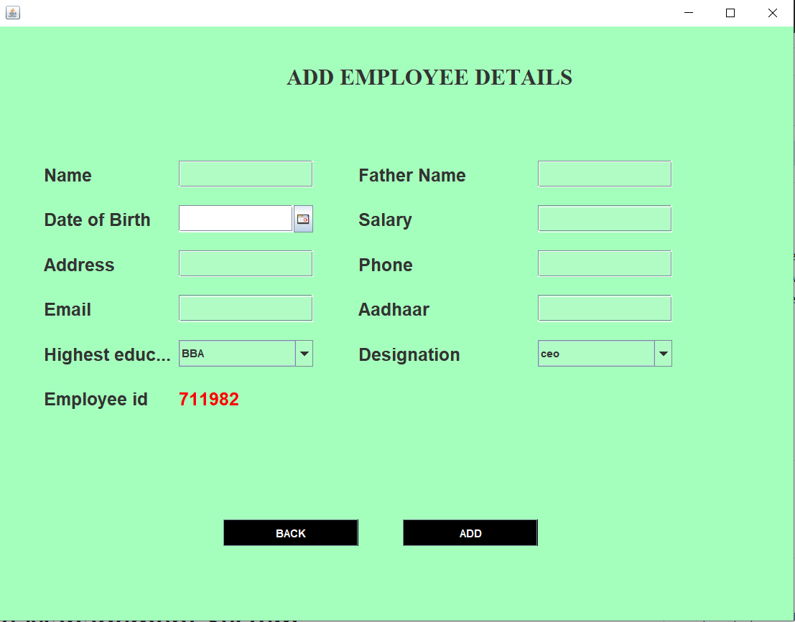
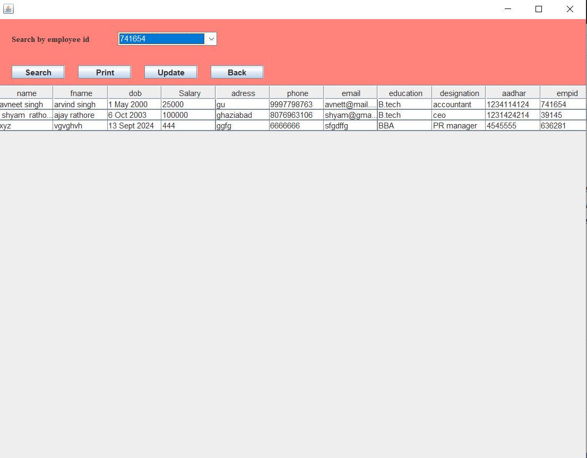
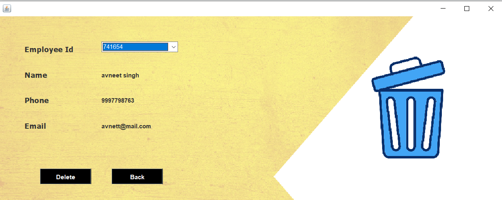

# Employee Management System
This Employee Management System is a Java-based desktop application developed using Java Swing for the frontend and SQL for the backend. It provides a simple yet powerful interface for managing employee data efficiently, offering essential functionalities such as adding, removing, updating, and viewing employee records.

# Features
- **Login Page:**
Secure login interface for administrators to access the system.
- **Add Employee:**
Allows administrators to add new employee details, including name, position, department, and other relevant information.
- **Remove Employee:**
Easily remove employee records from the database with a simple interface.
- **Update Employee:**
Update existing employee information, ensuring that all records are up-to-date.
- **View Employee:**
View all employee details in a structured format, with the ability to search and filter through the records.
# Technologies Used:
  - **Java Swing:** Used for building the graphical user interface (GUI) of the application.
  - **SQL:** Utilized for managing the employee database, handling all CRUD (Create, Read, Update, Delete) operations.
# Screenshots:

